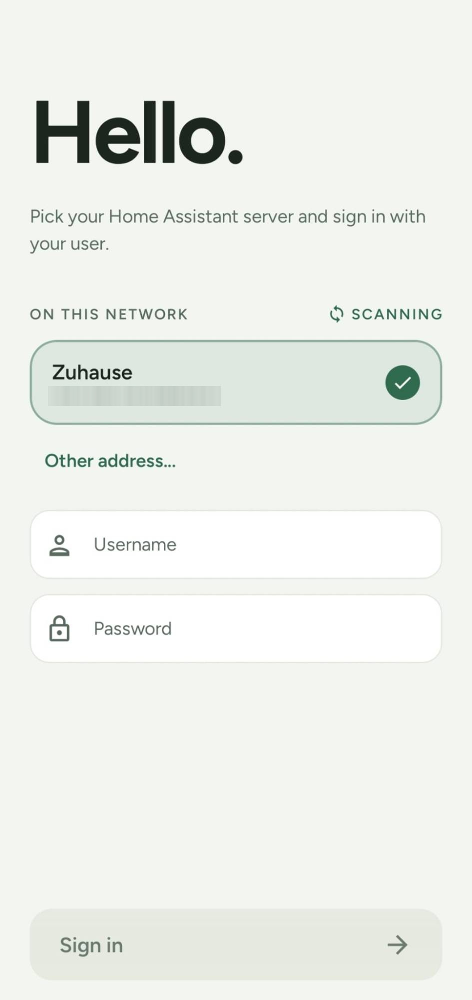
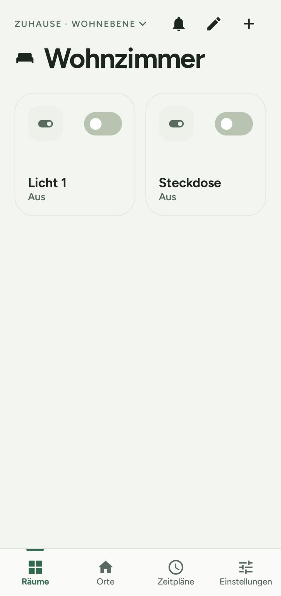
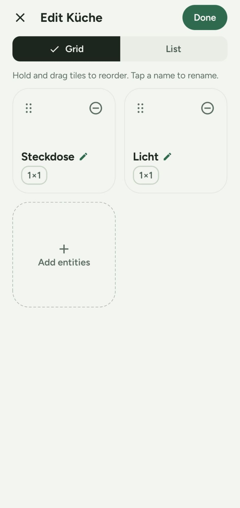
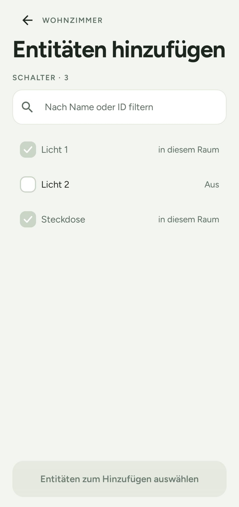
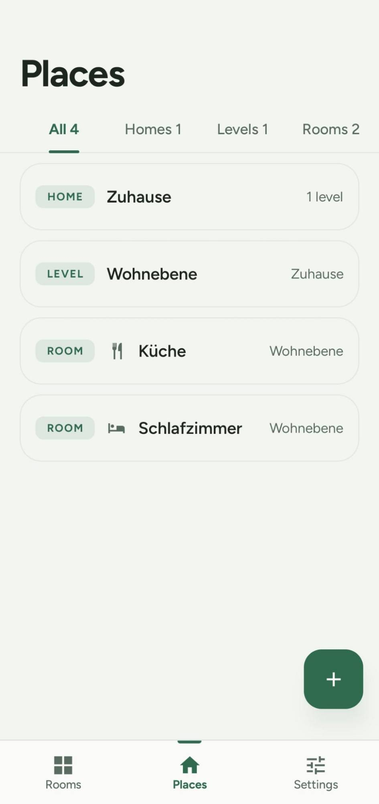
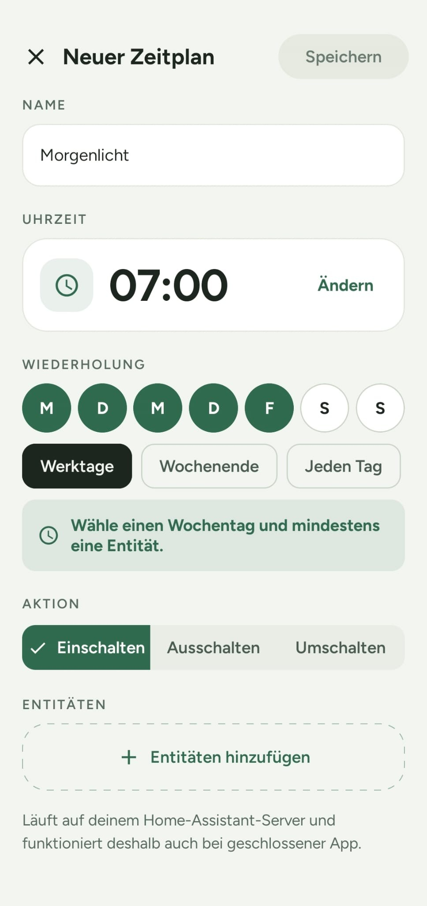

# HAAC – HA Android Client

Native Android client for Home Assistant. You build your own homes, levels and rooms on the phone and place the entities your Home Assistant admin shared with you through the companion integration [HAAC Bridge](https://github.com/stacknoise/haac-bridge).

> This project is not affiliated with or endorsed by Home Assistant, the Open Home Foundation or Nabu Casa.

## Why HAAC and not the Companion App?

The official Home Assistant Companion App shows everything the signed-in user can reach: Home Assistant has no per-entity permissions for users, so in practice every user sees every entity. **HAAC lets the admin share individual entities per user.** In the HAAC Bridge (on the Home Assistant side) the admin decides, user by user, which switches, sensors and climate devices the app may show and control, with domain, entity and wildcard rules and explicit excludes, in the Home Assistant UI or in YAML. A user who is not configured sees nothing. The app talks to entities only through the bridge, never through Home Assistant's generic state and service APIs, and each user arranges the shared entities in their own homes, levels and rooms.

This limits what the app shows and controls. It is not a Home Assistant permission: someone holding a user's access token can still use Home Assistant's standard API directly. Use a dedicated non-admin user per person (see the [bridge README](https://github.com/stacknoise/haac-bridge#security-note)).

**Status:** version 0.4.0, available as a signed sideload APK on GitHub Releases (not on Google Play yet). Feature complete for v1, plus schedules, a dark design and a demo mode.

- Supported entity domains in v1: switch, sensor, climate.
- Android 9 (API 28) or newer.
- Requires Home Assistant 2026.9.0 or newer with HAAC Bridge installed.
- Install: download `haac-vX.Y.Z-sideload.apk` from the [latest GitHub Release](https://github.com/stacknoise/haac-android/releases/latest), compare its SHA-256 with the `.sha256` file next to it and open it on the phone (allow installs from this source once).

## Screenshots

<table>
  <tr>
    <td align="center"><br>Sign in</td>
    <td align="center"><br>Rooms</td>
    <td align="center"><br>Edit layout</td>
  </tr>
  <tr>
    <td align="center"><br>Add entities</td>
    <td align="center"><br>Places</td>
    <td align="center"><br>New schedule</td>
  </tr>
</table>

The screenshots show the German interface; the app follows the system language.

## Features

**Sign-in and instances**
- *Try the demo* on the first screen opens a built-in demo instance with sample data (switches, sensors, a thermostat, rooms, a schedule and history), without a server, a network or a login. It is marked by a banner and removed like any instance.
- Sign in with your Home Assistant account, including multi-factor codes.
- Finds Home Assistant servers on your network (mDNS), or enter the address by hand; checks that HAAC Bridge is installed and recent enough.
- An internal (home network) and an external address per instance, chosen automatically. The internal `http://` address is used only after the app has confirmed the home network.
- Warns before an unencrypted connection to a private address, and trusts self-signed certificates on first use with a pinned public key and a shown fingerprint (a later change blocks the connection).
- Several Home Assistant instances, and several users of one instance: switcher, own name and accent colour per instance, remove with token revocation, add another address to an instance.

**Security**
- Only the refresh token is stored, encrypted with an Android Keystore key; passwords are never stored.
- Optional fingerprint unlock (Class 3 biometrics with a cryptographic key, not just a UI check), with an unlock window across instances and an app lock after a time in the background. It can be offered right after adding an instance.
- Screenshots and the recent-apps preview of sign-in and settings screens are blocked.

**Homes, levels and rooms**
- Your own structure: several homes, levels with a level number, rooms with or without a level. Sort order, rename, delete with undo.
- 16 built-in icons for homes, levels and rooms.
- Import levels and rooms from the areas and floors of Home Assistant (needs a current bridge); afterwards they are ordinary local places, nothing is synchronised.

**Entities and tiles**
- Pick from the entities shared with you and place them in as many rooms as you like; local names that never change Home Assistant.
- Tile sizes 1×1, 2×1 and 2×2, edit mode with drag and drop, grid or list, arrange, rename and remove.
- Entities that are removed or no longer shared stay as inactive tiles with a warning until you remove them.

**Control**
- Switches: toggle on the tile.
- Climate: target temperature dial with − and +, and on the detail screen HVAC mode, presets, fan, swing, humidity and target range as far as the device supports them.
- Optimistic display with rollback when Home Assistant does not confirm, and clear messages when an action is not available.

**Schedules**
- Time-controlled actions for switches, for example "every weekday at 06:45 turn the light on": turn on, turn off or toggle, at a fixed time on chosen weekdays or at sunrise or sunset with an offset of up to 3 hours.
- Schedules run **on the Home Assistant server** (in HAAC Bridge), so they work with the app closed or the phone off. The app is only the editor and keeps a read-only copy; creating and editing need a connection.
- A *Schedules* tab (shown only if the bridge supports schedules) with a *Next up* banner, an on/off switch per schedule, a detail screen with the next runs and the last run, and an editor with weekday presets and a *Run at* sheet.
- Home Assistant administrators also see all schedules (filter *All* / *Mine*) and can change or delete a foreign schedule, but only its owner changes its entities.
- Needs HAAC Bridge 0.2.1 or newer (0.2.2 or newer also puts the owner into the names of the schedule entities in Home Assistant).

**History and detail**
- Detail screen with state, readings, names, times and attributes.
- Charts for 24 hours, 7 days or a custom period: lines, statistics bands, bars for counters, timelines for switches and heating and cooling phases for climate devices.

**Live data and notifications**
- Live states over a persistent connection with automatic reconnect, address re-selection when the network changes, and a "stale" indication when the connection is down.
- A notification list for new or removed shared entities (with *Add to room*, *Review*, *Remove tile*, *Dismiss*, *Keep*), for your schedules that were removed or paused on the server, and for errors, grouped by day and instance. Mark read, swipe to delete, delete all.
- Every error has a code (`HAAC-…`) and a plain-language message; Settings shows diagnostics (connection, last sync, versions).

**App**
- Available in English and German (follows the system language; Home Assistant's own names such as HVAC and fan modes are shown as Home Assistant sends them).
- "Salbei" Material 3 theme in a light and a dark design (follows the phone or set under *Settings → Appearance*) with the Figtree font, flavors `play` and `sideload`, open-source licenses under *Settings → About*.

## Build

Requirements: JDK 21 (e.g. the one bundled with Android Studio) and the Android SDK.

```bash
./gradlew assembleDebug        # both flavors: play and sideload
./gradlew lint detekt test     # checks and unit tests
./gradlew codeIndex            # regenerate docs/code-index.md and docs/error-codes.md
```

Read the [developer guide](docs/development.md), [CLAUDE.md](CLAUDE.md) and [docs/concept.md](docs/concept.md) before contributing.

## Security

See [SECURITY.md](SECURITY.md).

## License

[Apache License 2.0](LICENSE). See [NOTICE](NOTICE). The bundled Figtree font is licensed under the SIL Open Font License 1.1 ([core/common/FONT-LICENSE-Figtree.txt](core/common/FONT-LICENSE-Figtree.txt)).
